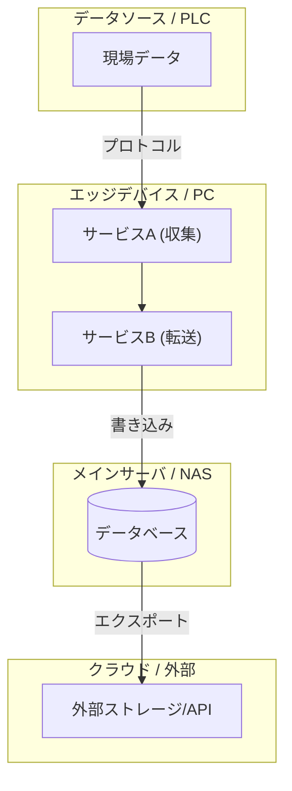

# System Architecture Visualizer

このスキルは、プロジェクトのシステム構成を「どの機器で」「どのサービスが動き」「どこにデータを送るか」という観点で可視化するための手順とパターンを提供します。

## ワークフロー

1.  **現状の整理**:
    *   登場する「機器」をリストアップする。
    *   各機器で動作する「サービス（プロセス）」を特定する。
    *   サービス間の「通信方向」と「プロトコル」を確認する。
2.  **図の作成**:
    *   下記のテンプレートを参考にMermaidコードを記述する。
    *   ラベルに改行 ` ` を入れて、読みやすさを調整する。
3.  **ドキュメントへの配置**:
    *   `README.md` 等に Mermaid ブロックとして挿入する。
    *   図の下に各コンポーネントの役割や、設計のポイントを解説として加える。

## Mermaid デザインパターン

### 1. 標準的な構成図テンプレート

### 2. コンポーネント命名規則

*   **機器名**: 大文字または判別しやすい固有名詞（例: `Jetson`, `PLC`, `NAS`）
*   **サービス名**: 機能がわかる名称（例: `OPC UA Server`, `InfluxDB`, `Data Exporter`）
*   **通信ラベル**: 通信方式や内容を明記（例: `|OPC UA|`, `|HTTPS/JSON|`, `|1時間毎CSV出力|`）

## 追加リソース

*   より詳細な設計パターンについては [references/design-patterns.md](references/design-patterns.md) を参照してください。
